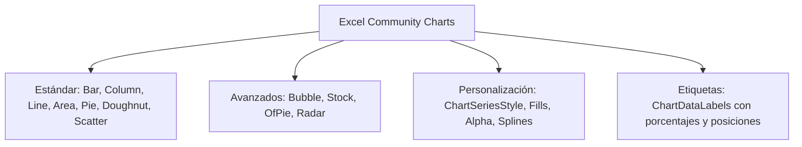
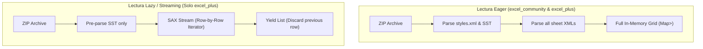
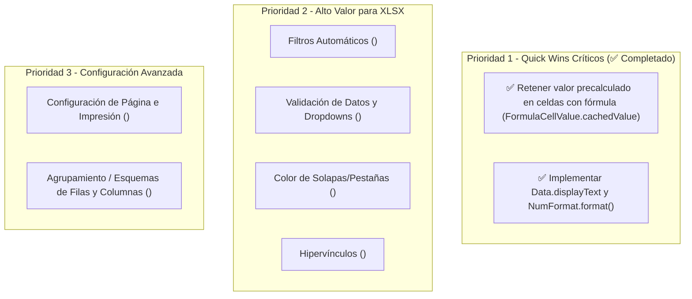

# Comparativa Técnica Profunda: excel_community vs excel_plus

Este documento proporciona un análisis exhaustivo y de bajo nivel de la arquitectura, capacidades, diferencias, trade-offs técnicos y modos de falla entre **`excel_community`** y **`excel_plus`**, centrándose en la **lectura** y **generación** de hojas de cálculo bajo el estándar **OpenXML (XLSX / SpreadsheetML)** y el formato legacy **XLS (BIFF8 / OLE2)**.

---

## 📑 Índice
1. [Resumen Ejecutivo y Filosofía de Diseño](#1-resumen-ejecutivo-y-filosofía-de-diseño)
2. [Matriz Comparativa de Capacidades Técnicas](#2-matriz-comparativa-de-capacidades-técnicas)
3. [Generación de Archivos XLSX (Escritura OOXML)](#3-generación-de-archivos-xlsx-escritura-ooxml)
   - 3.1 [Gráficos y Visualización (`<c:chartSpace>`)](#31-gráficos-y-visualización-cchartspace)
   - 3.2 [Formato Condicional y Estilos Diferenciales (`<conditionalFormatting>`, `<dxfs>`)](#32-formato-condicional-y-estilos-diferenciales-conditionalformatting-dxfs)
   - 3.3 [Tablas Dinámicas (`PivotTable`)](#33-tablas-dinámicas-pivottable)
   - 3.4 [Comentarios y Anotaciones Flotantes (`<comments>`, VML)](#34-comentarios-y-anotaciones-flotantes-comments-vml)
   - 3.5 [Protección de Hojas y Seguridad (`<sheetProtection>`)](#35-protección-de-hojas-y-seguridad-sheetprotection)
   - 3.6 [Vistas, Paneles Congelados y Visibilidad](#36-vistas-paneles-congelados-y-visibilidad)
   - 3.7 [Motor de Estilos y Formatos Numéricos (`<styleSheet>`)](#37-motor-de-estilos-y-formatos-numéricos-stylesheet)
4. [Lectura de Archivos XLSX (Decodificación OOXML)](#4-lectura-de-archivos-xlsx-decodificación-ooxml)
   - 4.1 [Pipeline de Parsing Eager vs Lazy](#41-pipeline-de-parsing-eager-vs-lazy)
   - 4.2 [Tratamiento de Celdas con Fórmulas (`<f>` vs `<v>`)](#42-tratamiento-de-celdas-con-fórmulas-f-vs-v)
   - 4.3 [Renderizado de Texto de Salida (`displayText`)](#43-renderizado-de-texto-de-salida-displaytext)
   - 4.4 [Robustez de Parser y Manejo de Shared Strings](#44-robustez-de-parser-y-manejo-de-shared-strings)
5. [Análisis Crítico de la Lectura Lazy / Streaming (`streamRows`)](#5-análisis-crítico-de-la-lectura-lazy--streaming-streamrows)
   - 5.1 [¿Qué es y cómo funciona técnicamente?](#51-qué-es-y-cómo-funciona-técnicamente)
   - 5.2 [Limitaciones y Modos de Falla del Enfoque Lazy](#52-limitaciones-y-modos-de-falla-del-enfoque-lazy)
   - 5.3 [Cuello de Botella Oculto: La Shared Strings Table (SST)](#53-cuello-de-botella-oculto-la-shared-strings-table-sst)
   - 5.4 [Matriz de Decisión: ¿Cuándo usar Lazy y cuándo falla?](#54-matriz-de-decisión-cuándo-usar-lazy-y-cuándo-falla)
6. [Motor de Fórmulas y Recálculo Interno](#6-motor-de-fórmulas-y-recálculo-interno)
7. [Lectura de Archivos Legacy XLS (Excel 97-2003)](#7-lectura-de-archivos-legacy-xls-excel-97-2003)
8. [Diagnóstico de Gaps y Roadmap Sugerido para `excel_community`](#8-diagnóstico-de-gaps-y-roadmap-sugerido-para-excel_community)

---

## 1. Resumen Ejecutivo y Filosofía de Diseño

```
┌─────────────────────────────────────────────────────────────────────────────────┐
│                              FILOSOFÍAS DE DISEÑO                               │
├────────────────────────────────────────┬────────────────────────────────────────┤
│           excel_community              │               excel_plus               │
├────────────────────────────────────────┼────────────────────────────────────────┤
│ • Autoría visual rica y completa       │ • Procesamiento analítico de datos     │
│ • Arquitectura Modular (Clean Code)    │ • Lectura en Streaming / Lazy          │
│ • Máxima fidelidad de elementos Excel: │ • Motor de cálculo en memoria (AST)    │
│   (11 gráficos, conditional format,    │ • Renderizado rápido de strings de UI  │
│   comentarios, protección XOR, etc.)   │ • Enfoque en pipelines e importaciones │
└────────────────────────────────────────┴────────────────────────────────────────┘
```

* **`excel_community`**: Prioriza la **creación y edición enriquecida** de libros de cálculo de calidad profesional para Microsoft Excel y Google Sheets. Diseñado con una arquitectura modular orientada a objetos donde cada responsabilidad (gráficos, estilos, comentarios, hojas, workbook) tiene managers dedicados (`save/styles/`, `save/charts/`, `parser/worksheet_parser.dart`, etc.).
* **`excel_plus`**: Prioriza el **procesamiento analítico y la ingesta rápida de datos**. Introduce un pipeline de streaming perezoso para leer archivos masivos sin desbordar memoria y un evaluador de fórmulas interno en Dart.

---

## 2. Matriz Comparativa de Capacidades Técnicas

| Característica / Módulo | `excel_community` | `excel_plus` | Detalle Técnico / Comportamiento |
| :--- | :---: | :---: | :--- |
| **Estándar OpenXML (XLSX)** | ✅ Completo | ✅ Completo | Empaquetado ZIP/OOXML conforme a ECMA-376. |
| **Catálogo de Gráficos** | ✅ **11 Tipos** | ⚠️ ~7 Tipos | `excel_community` incluye Bubble, Stock, Of-Pie (Pie/Bar-of-Pie) y Radar. |
| **Subtipos de Gráficos** | ✅ Clustered, Stacked, %Stacked, Spline | ⚠️ Estándar | `excel_community` soporta `smooth` (curvas), `showMarkers`, `bubbleScale`. |
| **Estilos por Serie de Gráfico** | ✅ Granular (`ChartSeriesStyle`) | ⚠️ Limitado | Fills sólidos, transparentes (`fillAlpha`), sin relleno y bordes con grosor EMU. |
| **Etiquetas de Gráfico (`DataLabels`)** | ✅ Sí | ✅ Sí | Value, categoryName, seriesName, percentage, separador y posición. |
| **Formato Condicional (`<dxfs>`)** | ✅ Nativo completo | ❌ No disponible | Reglas `cellIs`, texto, fórmulas `expression`, duplicados/únicos. |
| **Tablas Dinámicas (Pivot Tables)** | ✅ Sí | ⚠️ Básico | Generación de `<pivotTableDefinition>` y `<pivotCacheDefinition>`. |
| **Comentarios de Celda (`cell.comment`)** | ✅ Sí | ❌ No disponible | XML `<comments>` + relación y formas VML (`<v:shape>`). |
| **Paneles Congelados (`Freeze Panes`)** | ✅ Multi-hoja dinámico | ✅ Sí | Generación de `<pane>` con split x/y, activePane y selección correcta. |
| **Protección con Contraseña** | ✅ Sí (16-bit XOR Hash) | ⚠️ Parcial | Atributos completos de `<sheetProtection>` y bloqueo de celdas (`locked`). |
| **Filas/Columnas Ocultas** | ✅ Sí | ✅ Sí | Serialización y lectura de `<row hidden="1">` y `<col hidden="1">`. |
| **Dimensiones de Celdas** | ✅ Ancho/Alto + AutoFit | ✅ Ancho/Alto | Custom row height, custom column width y defaults. |
| **Imágenes en Hoja (`ExcelImage`)** | ✅ Sí | ✅ Sí | Inserción de imágenes con anclaje a celdas en Drawings OOXML. |
| **Formatos Numéricos (ECMA-376)** | ✅ Estándar (0–49) + Custom | ✅ Estándar (0–49) + Custom | Moneda (5-8), Contabilidad (41-44), Fechas CJK (27-36) y asignación >= 164. |
| **Renderizado de Texto (`displayText`)** | ✅ Sí (`Data.displayText`) | ✅ Sí (`Data.displayText`) | Ambos formatean el valor a texto según su `NumFormat` (`excel_community`: `NumFormat.format`, best-effort sobre los ~50 formatos estándar + patrones custom comunes). |
| **Lectura Lazy / Streaming (`streamRows`)** | ❌ Carga completa | ✅ Sí (`streamRows`) | `excel_plus` lee fila por fila desde el stream SAX sin instanciar la matriz. |
| **Preservación de `<v>` en Fórmulas** | ✅ Lee `<f>` y `<v>` (`FormulaCellValue.cachedValue`) | ✅ Lee `<f>` y `<v>` | Ambas retienen el resultado precalculado; `excel_community` no lo recalcula ni lo vuelve a escribir al guardar. |
| **Motor de Recálculo de Fórmulas** | ❌ No (solo texto) | ✅ Sí (`recalculate`) | Intérprete AST con dependencias incrementales (`changed: [...]`). |
| **Lectura Legacy `.xls` (BIFF8/OLE2)** | ✅ Nativo en Dart | ✅ Nativo en Dart | Decodificador CFB y parseo de registros BIFF8. |

---

## 3. Generación de Archivos XLSX (Escritura OOXML)

### 3.1 Gráficos y Visualización (`<c:chartSpace>`)

En la generación de gráficos, **`excel_community` ofrece una cobertura superior de la especificación OOXML**:



#### Tipos de Gráficos Soportados:
1. **`ColumnChart` y `BarChart`**: Con variantes Clustered, Stacked y PercentStacked (`<c:grouping val="stacked"/>`).
2. **`LineChart`**: Con opción de marcadores (`showMarkers`) y curvas spline suavizadas (`smooth = true` ➔ `<c:smooth val="1"/>`).
3. **`AreaChart`**: Clustered, Stacked y PercentStacked.
4. **`ScatterChart`**: Con control independiente de líneas (`showLines`) y marcadores.
5. **`PieChart` y `DoughnutChart`**: Con control de radio interior (`holeSize`).
6. **`RadarChart` (`<c:radarChart>`)**: Radar estándar, con marcadores o relleno (`RadarStyle.filled`).
7. **`BubbleChart` (`<c:bubbleChart>`)**: Gráficos tridimensionales (X, Y, Radio de burbuja) con `bubbleScale` y soporte de burbujas negativas.
8. **`StockChart` (`<c:stockChart>`)**: Gráficos bursátiles/financieros (HLC, OHLC) con líneas High-Low (`<c:hiLowLines>`) y barras Up-Down (`<c:upDownBars>`).
9. **`OfPieChart` (`<c:ofPieChart>`)**: Gráficos secundarios Pie-of-Pie y Bar-of-Pie con tipo de división configurable (`position`, `value`, `percent`) y tamaño de subgráfico (`secondPieSize`).

#### Estilos y Etiquetas de Series (`ChartSeriesStyle` / `ChartDataLabels`):
* **Fills**: Sólidos (`ChartFillType.solid`), con transparencia (`fillAlpha: 0.5` ➔ `<a:alpha val="50000"/>`), o sin relleno (`ChartFillType.none`).
* **Bordes**: Control de color hexadecimal, alpha y grosor en EMUs (`borderWidth`).
* **DataLabels**: Posicionamiento (`bestFit`, `insideEnd`, `outsideEnd`, etc.), separadores personalizados y flags independientes para valor, nombre de serie, nombre de categoría y porcentaje.

---

### 3.2 Formato Condicional y Estilos Diferenciales (`<conditionalFormatting>`, `<dxfs>`)

`excel_community` cuenta con un subsistema completo de formato condicional:
* **Serialización a `<dxfs>` en `styles.xml`**: Define estilos diferenciales (fuente, borde, relleno) aplicados dinámicamente según las reglas.
* **Tipos de Reglas Soportadas**:
  * `cellIs`: Rangos numéricos (`greaterThan`, `lessThan`, `between`, `equal`, etc.).
  * Texto: `containsText`, `notContains`, `beginsWith`, `endsWith`.
  * Fórmulas: `expression` con fórmulas dinámicas.
  * Valores duplicados / únicos: `duplicateValues`, `uniqueValues`.
* **Secuenciación de Prioridad**: Administra la prioridad global de reglas a nivel de hoja para evitar colisiones de estilo en Excel.

---

### 3.3 Tablas Dinámicas (`PivotTable`)

Ambas librerías admiten la definición de tablas dinámicas generando los componentes canónicos de OpenXML:
* `xl/pivotTables/pivotTableX.xml` (`<pivotTableDefinition>`).
* `xl/pivotCache/pivotCacheDefinitionX.xml` y `pivotCacheRecordsX.xml`.
* Relaciones `.rels` y registros en `[Content_Types].xml`.

---

### 3.4 Comentarios y Anotaciones Flotantes (`<comments>`, VML)

`excel_community` soporta comentarios de celda (`cell.comment = "Texto"`):
* Genera el archivo `xl/commentsX.xml` con autores y textos de comentario.
* Genera la capa de dibujo VML en `xl/drawings/vmlDrawingX.vml` con `<v:shape>` y `<x:ClientData ObjectType="Note">`, calculando el anclaje exacto de fila y columna (`<x:Row>`, `<x:Column>`) para visualización nativa en Excel y Google Sheets.

---

### 3.5 Protección de Hojas y Seguridad (`<sheetProtection>`)

`excel_community` implementa el algoritmo de hash de 16 bits XOR estándar de Excel para protección con contraseña:
* Genera `<sheetProtection password="HEX" sheet="1" objects="1" scenarios="1" .../>`.
* Permite configurar permisos granulares (permitir formato de celdas, inserción de filas, selección de celdas bloqueadas/desbloqueadas).
* Modela las propiedades `locked` y `hidden` en `CellStyle` serializadas en `<xf><protection locked="1" hidden="1"/></xf>`.

---

### 3.6 Vistas, Paneles Congelados y Visibilidad

* **Paneles Congelados (`<pane>`)**: Permite `sheet.frozenRows = X` y `sheet.frozenColumns = Y`. `excel_community` computa dinámicamente la celda activa superior izquierda (`topLeftCell`), el estado `state="frozen"`, la posición del split (`xSplit`, `ySplit`) y la selección de panel activo (`activePane`), garantizando que Excel abra el libro sin mostrar alertas de recuperación.
* **Ocultar Filas/Columnas**: Emisión correcta de `<col min="X" max="X" hidden="1"/>` y `<row r="Y" hidden="1"/>`.

---

### 3.7 Motor de Estilos y Formatos Numéricos (`<styleSheet>`)

* **Tabla ECMA-376 Completa (IDs 0–49)**: Mapeo exhaustivo de formatos estándar, incluyendo monedas (5–8), formatos contables con caracteres de relleno `_(* ...)` (41–44) y fechas CJK (27–36).
* **Formatos Personalizados**: Detección inteligente entre formatos de fecha (`CustomDateTimeNumFormat`) y formatos numéricos (`CustomNumericNumFormat`), asignando IDs >= 164 con reescritura idempotente.

---

## 4. Lectura de Archivos XLSX (Decodificación OOXML)

### 4.1 Pipeline de Parsing Eager vs Lazy



---

### 4.2 Tratamiento de Celdas con Fórmulas (`<f>` vs `<v>`)

Cuando Excel guarda una celda con fórmula, genera:
```xml
<c r="C1" t="n">
    <f>SUM(A1:B1)</f>
    <v>150</v>
</c>
```

* **Comportamiento actual en `excel_community`**:
  * Parsea `<f>` y crea un `FormulaCellValue("SUM(A1:B1)")`.
  * **Retiene el valor `<v>` (`150`)** en `FormulaCellValue.cachedValue` (implementado — ver Sección 8).
  * El valor cacheado no se recalcula ni se vuelve a escribir al guardar; refleja únicamente lo que Excel tenía calculado en el archivo leído.
* **Comportamiento en `excel_plus`**:
  * Lee `<f>` y almacena también el resultado precalculado `<v>`.
  * Permite consultar tanto la fórmula como el valor resuelto.

---

### 4.3 Renderizado de Texto de Salida (`displayText`)

* **`excel_plus`**: Incorpora `NumFormat.format(value)` y `Data.displayText`. Si una celda almacena `1234.5` con formato `$#,##0.00`, `cell.displayText` retorna automáticamente `"$1,234.50"`.
* **`excel_community`**: Incorpora el mismo par `NumFormat.format(value)` / `Data.displayText` (implementado — ver Sección 8), con cobertura best-effort de los ~50 formatos estándar ECMA-376 más los patrones custom de moneda/porcentaje/fecha más comunes.

---

### 4.4 Robustez de Parser y Manejo de Shared Strings

Ambas librerías resuelven los principales casos límite de la especificación OOXML:
* Shared strings duplicadas y elementos `<si/>` vacíos autocerrados.
* Targets relativos (`worksheets/sheet1.xml`) y absolutos (`/xl/worksheets/sheet1.xml`).
* Celdas estilizadas vacías (`<c r="A1" s="1"/>`) y preservación de bordes en celdas combinadas.

---

## 5. Análisis Crítico de la Lectura Lazy / Streaming (`streamRows`)

### 5.1 ¿Qué es y cómo funciona técnicamente?

La lectura por streaming (`Excel.streamRows(sheetName)`) en `excel_plus` utiliza un generador (`sync*` / `Iterable`) que se conecta directamente al flujo de eventos SAX del descompresor ZIP. Emite cada fila (`List<CellValue?>`) a medida que se cierra el tag `</row>` en el XML y **descarta la memoria de la fila anterior** sin poblar la estructura de datos del libro.

---

### 5.2 Limitaciones y Modos de Falla del Enfoque Lazy

Aunque el streaming reduce el uso de memoria RAM (~43% en 40k filas) y acelera la lectura en un ~30%, **falla significativamente como lector completo de planillas de cálculo**:

```
┌─────────────────────────────────────────────────────────────────────────────────┐
│                    ¿QUÉ SE PIERDE CON LA LECTURA LAZY?                          │
├─────────────────────────────────────────────────────────────────────────────────┤
│ ❌ ESTILOS:          No lee styles.xml (Sin fuentes, colores, negritas ni fondos)│
│ ❌ NÚMERO FORMAT:    No lee el formato numérico (moneda, porcentaje, contable)  │
│ ❌ CELDAS COMBINADAS: Rompe la estructura de <mergeCells> (B1 y C1 vienen null)  │
│ ❌ METADATOS:        Ignora anchos de columna, altos de fila y filas ocultas    │
│ ❌ VISTAS:           Ignora paneles congelados (Freeze Panes) y filtros         │
│ ❌ GRÁFICOS Y OBJETOS: Ignora gráficos, imágenes, comentarios y tablas          │
│ ❌ INMUTABILIDAD:    Es de SOLO LECTURA (No se puede editar ni volver a guardar) │
└─────────────────────────────────────────────────────────────────────────────────┘
```

#### 1. Desalineación por Matrices Dispersas (*Sparse XML*):
En OpenXML, Excel no emite celdas vacías. Si una fila solo tiene datos en las columnas `A` y `D`:
```xml
<row r="1">
    <c r="A1"><v>10</v></c>
    <c r="D1"><v>40</v></c>
</row>
```
Si el parser de streaming no calcula las diferencias de coordenadas entre `A` (col 0) y `D` (col 3) rellenando con `null`, la lista resultante queda desfasada (`[10, 40]` en lugar de `[10, null, null, 40]`). Además, si hay filas vacías intermedias (ej. salta de la fila 4 a la 8), el stream emite la fila 8 inmediatamente después de la 4.

#### 2. Pérdida de Celdas Combinadas (*Merged Cells*):
Si `A1:D1` es un título fusionado con el texto `"Balance Anual"`, el streaming emite `A1 = "Balance Anual"` y `B1=null, C1=null, D1=null` sin ninguna indicación de que esas celdas están cubiertas por una combinación.

---

### 5.3 Cuello de Botella Oculto: La Shared Strings Table (SST)

El streaming de filas en XLSX tiene un **límite físico insalvable**:
* En hojas XLSX estándar, todo el texto se almacena en `xl/sharedStrings.xml` (`t="s"` con puntero `<v>45</v>`).
* Para poder emitir `TextCellValue("Juan")` durante el streaming de la fila, el parser **está obligado a leer y parsear previamente todo el archivo `sharedStrings.xml` en memoria RAM**.
* **Impacto**: Si un archivo tiene 1.000.000 de textos únicos y su `sharedStrings.xml` pesa 80 MB, el streaming de filas **no puede evitar ese consumo de memoria inicial**.

---

### 5.4 Matriz de Decisión: ¿Cuándo usar Lazy y cuándo falla?

| Escenario de Uso | ¿Sirve Lazy Streaming? | Comportamiento / Diagnóstico |
| :--- | :---: | :--- |
| **Ingesta Masiva a Base de Datos (100k+ filas)** | ✅ **Ideal** | Solo importan los valores crudos; bajo uso de RAM. |
| **Validación de Subidas de Archivos en Servidor** | ✅ **Ideal** | Se cancela el stream en el primer error (`break`) sin leer el resto. |
| **Renderizar una Tabla Visual en Flutter (DataGrid)** | ❌ **Falla** | Pierde colores, fuentes, anchos de columna y celdas combinadas. |
| **Editar celdas y exportar/guardar el archivo** | ❌ **Falla** | `streamRows` es unidireccional y descartable; no crea el modelo editable. |
| **Leer archivos con Gráficos, Fórmulas o Comentarios** | ❌ **Falla** | Todos los objetos extendidos son completamente ignorados. |

---

## 6. Motor de Fórmulas y Recálculo Interno

| Característica | `excel_community` | `excel_plus` |
| :--- | :---: | :---: |
| **Almacenamiento de Fórmulas** | ✅ `FormulaCellValue` | ✅ `FormulaCellValue` |
| **Evaluación en Dart (`recalculate`)** | ❌ No | ✅ Sí |
| **Recálculo Incremental** | ❌ No | ✅ Sí (`changed: ['A1', ...]`) |
| **Grafo de Dependencias** | ❌ No | ✅ Bounding-box estático |
| **Detección de Circularidad** | ❌ No | ✅ Retorna `#CIRC` |
| **Manejo de Desbordamiento (*Spill*)** | ❌ No | ✅ Sí (Dynamic Arrays) |
| **Funciones de Base de Datos** | ❌ No | ✅ `DSUM`, `DAVERAGE`, `DCOUNT`, `DMAX`, etc. |
| **Funciones de Ingeniería** | ❌ No | ✅ `DEC2BIN`, `BIN2DEC`, `BITAND`, `CONVERT`, etc. |

* **Impacto práctico**: Si el objetivo es generar archivos `.xlsx` para abrirlos en Excel, la ausencia del motor de recálculo interno en `excel_community` **no afecta**, ya que Excel calcula todas las fórmulas automáticamente al abrir el archivo. No obstante, si se necesita calcular resultados dentro de una app Dart/Flutter sin abrir Excel, `excel_plus` dispone de dicha capacidad.

---

## 7. Lectura de Archivos Legacy XLS (Excel 97-2003)

Ambas librerías cuentan con soporte equivalente de **solo lectura** para archivos `.xls` antiguos:
* **Parser OLE2/CFB (Compound File Binary)**: Navega la cabecera (512 bytes), sectores FAT, MiniFAT, DIFAT y cadenas de directorios en Dart puro.
* **Parser BIFF8**:
  * Decodifica registros `BOF` (0x0809), `EOF` (0x000A), `BOUNDSHEET` (0x0085), `DIMENSIONS` (0x0200).
  * Lee celdas `LABELSST` (Shared Strings BIFF8 en UTF-16LE), `NUMBER` (Double IEEE 754), `RK` / `MULRK` (enteros y flotantes compactos de 30 bits) y `FORMULA`.
  * Integración transparente en `Excel.decodeBytes()` mediante detección de magic bytes (`D0 CF 11 E0 A1 B1 1A E1`).

---

## 8. Diagnóstico de Gaps y Roadmap Sugerido para `excel_community`

Para complementar la solidez de `excel_community` en generación y alcanzar la máxima paridad técnica en lectura, se identifican las siguientes oportunidades de mejora priorizadas:



### 📋 Detalle del Plan de Acción Sugerido:

1. ✅ **Retención de `<v>` en Fórmulas** — completado: `_WorksheetParser` y `FormulaCellValue.cachedValue` almacenan el valor precalculado cuando el archivo lo tenía.
2. ✅ **`Data.displayText` y `NumFormat.format()`** — completado: formateador numérico/fecha best-effort (`lib/src/number_format/format_renderer.dart`) que transforma valores brutos (`1234.5`) en cadenas formateadas (`"$1,234.50"`), habilitando su consumo directo en UIs.
3. **Filtros Automáticos (`<autoFilter>`)**:
   * Añadir `Sheet.setAutoFilter(CellIndex start, CellIndex end)` y serializar `<autoFilter ref="A1:D1"/>` en `sheetX.xml`.
4. **Validación de Datos (`<dataValidation>`)**:
   * Permitir listas desplegables (dropdowns) en celdas mediante `<dataValidation type="list">`.
5. **Color de Solapas/Pestañas (`<tabColor>`)**:
   * Permitir asignar un color personalizado a la pestaña inferior de cada hoja (`sheet.tabColor`).
6. **Hipervínculos (`<hyperlinks>`)**:
   * Permitir asignar enlaces a URLs externas, correos o celdas internas en `sheetX.xml`.
7. **Configuración de Página e Impresión (`<pageSetup>`)**:
   * Soporte para orientación de página (horizontal/vertical), tamaño de papel (A4, Carta) y ajuste a una página.

